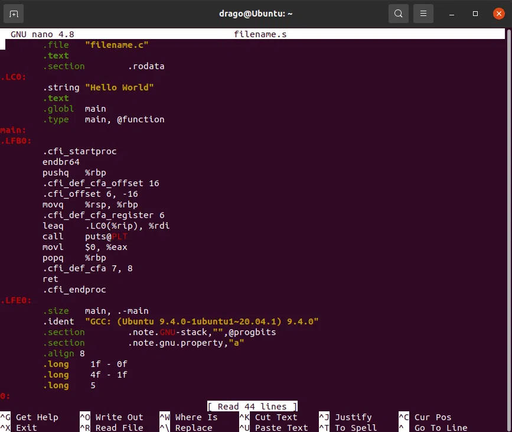

# Tema 2

En este tema realizaremos las siguientes actividades:
- **Editar código fuente**
- **Compilar código fuente a código objeto**
- **Ejecutar código ejecutable**

## Pasos del proceso de creación de aplicación
|Editar código fuente | Compilar el código fuente | Ejecutar el código
|---------------------|---------------------------|--------------------
|Elegimos editor    | - Elegimos compilador     | - Buscamos el archivo ejecutable
|Abrimos editor     | - Le pasamos código fuente| - Ejecutamos el archivo
|Escribimos código  | - Ejecutamos compilador   |
|Guardamos | |

Tareas por realizar:
- [x] ~Editar~
- [ ] Compilar
- [ ] Ejecutar

